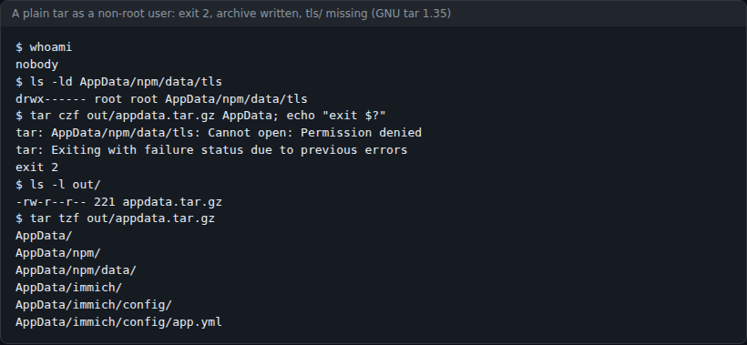
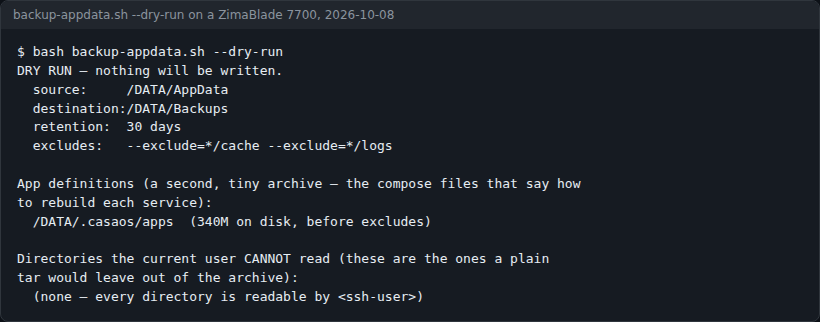
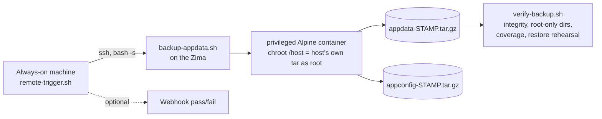

# ZimaBlade server recipes

Verified recipes for running a ZimaBlade (ZimaOS or CasaOS) like a server rather than an appliance: getting root through Docker, AppData backups that really include your certificates, and an offsite photo-library backup that uploads each original once.



[](LICENSE)


ZimaOS is appliance-shaped on purpose: the root filesystem is read-only, the SSH user can't `sudo`, `cron` isn't enabled, and an OS update can replace anything you installed. That is why it is hard to break. It also means most homelab advice doesn't apply, and some of it fails quietly. These recipes work with that design instead of against it. They were written on a ZimaBlade 7700 running a photo library, a reverse proxy and single sign-on, and every command was run on that machine, including the attempts that turned out wrong.

## What it does

- **Recipe 00** explains the privileged-container one-liner that gives you root on a box where `sudo` wants a password you don't have, part by part, with the risks spelled out.
- **Recipe 01** and `backup-appdata.sh` back up `/DATA/AppData` as real root, so 0700 directories (TLS keys, tunnel tokens, auth databases) are in the archive, plus a second small archive of the app definitions (compose files) that live outside AppData.
- `backup-appdata.sh --dry-run` lists the AppData directories your SSH user can't read, which are the ones a plain `tar` would leave out.
- `verify-backup.sh` checks an archive four ways: gzip integrity, whether the root-only directories made it in, coverage against live AppData, and a restore rehearsal.
- `remote-trigger.sh` runs the backup from another always-on machine over SSH, so nothing is installed on the Zima and there is no cron to enable. It can post pass or fail to a webhook.
- **Recipe 02** and `photo-offsite-backup.sh` copy an Immich library offsite with `rclone copy` (never `sync`), originals only, after a database dump that refuses to replace a good dump with a bad one.

## Screenshots

| | |
|---|---|
|  |  |
| The trap recipe 01 exists for, reproduced on 2026-10-08 with GNU tar 1.35 (the version ZimaOS ships) on a Linux box, as user `nobody`, against a sample `AppData` with one root-owned 0700 `tls` directory. Exit 2, an archive anyway, and no `tls/` inside. | `backup-appdata.sh --dry-run` on the author's ZimaBlade 7700, 2026-10-08. The SSH username is replaced with `<ssh-user>`. On this run every AppData directory was readable by the SSH user, so a plain tar would have missed nothing; that is not true on every box, which is why the dry run checks. |

## Quick start

You need a ZimaBlade, ZimaBoard or other ZimaOS / CasaOS box with SSH access, and an SSH user in the `docker` group (the default on ZimaOS).

```bash
git clone https://github.com/casareanderson/zimablade-recipes
cd zimablade-recipes
```

1. Read **[00 · Borrowing root from Docker](recipes/00-borrowing-root-from-docker.md)** first. It is short, and every other recipe depends on it.
2. Copy `scripts/backup-appdata.sh` to the Zima and do a dry run. It changes nothing:

   ```bash
   bash backup-appdata.sh --dry-run
   ```

   Success looks like the second screenshot: your source and destination, the app-definition directory and its size, and a list of directories a plain tar would miss (or "none").
3. Make a real backup, then prove it is complete:

   ```bash
   bash backup-appdata.sh
   bash verify-backup.sh
   ```

Read the scripts before you run them, including these. `backup-appdata.sh` runs a privileged container, which is root on the machine.

## Usage

### The recipes

| | What it solves | The bit nobody mentions |
|---|---|---|
| **[00 · Borrowing root from Docker](recipes/00-borrowing-root-from-docker.md)** | You need root on a box where `sudo` wants a password you don't have | A privileged container with the host filesystem mounted *is* root. Powerful, and worth understanding before you paste it |
| **[01 · Backing up AppData properly](recipes/01-backing-up-appdata.md)** | Your app data: Immich's database, your certificates, your tokens | A plain `tar` exits 2 and **still writes the archive**. It looks fine and your certs aren't in it |
| **[02 · Offsite backup for a photo library](recipes/02-offsite-photo-backup.md)** | Getting a large, irreplaceable photo library out of the house, affordably | `rclone sync` mirrors deletions: lose a photo locally and your backup deletes it too. And much of the library is regenerable |

### The scripts

```bash
bash backup-appdata.sh --dry-run             # on the Zima: what would a plain tar miss?
bash backup-appdata.sh                       # on the Zima: full backup as real root
bash verify-backup.sh [archive.tar.gz]       # on the Zima: newest archive by default
ZIMA=alice@192.0.2.10 bash remote-trigger.sh # from another machine, over SSH
DRY_RUN=1 bash photo-offsite-backup.sh       # on the photo host: what would transfer
```

To schedule it, run `remote-trigger.sh` from cron or a systemd timer on a machine that is already always on (a Raspberry Pi, another NAS, a small VM). Set up an SSH key once with `ssh-copy-id` so it runs unattended.

## Configuration

Every setting is an environment variable with a default; nothing needs editing.

| Variable | Default | Script | What it does |
|---|---|---|---|
| `SRC_DIR` | `/DATA/AppData` | backup, verify | What to back up |
| `DEST_DIR` | `/DATA/Backups` | backup, verify | Where archives go |
| `RETENTION_DAYS` | `30` | backup | Delete archives older than this |
| `EXCLUDES` | `--exclude=*/cache --exclude=*/logs` | backup | tar excludes for AppData |
| `CONFIG_DIRS` | `/DATA/.casaos/apps` | backup | App definitions, archived separately |
| `CONFIG_EXCLUDES` | `*.dump *.sql *.tar.gz *.bak*` | backup | Leaves old dumps out of the definitions archive |
| `ZIMA` | required | remote-trigger | `user@host` to SSH into |
| `PAYLOAD` | `backup-appdata.sh` beside it | remote-trigger | Script streamed over SSH |
| `LOG` | `~/.local/state/zima-backup.log` | remote-trigger | Local run log |
| `WEBHOOK` | empty | remote-trigger | URL that accepts `{"content": "..."}` (Discord, ntfy ...) for a pass/fail message |
| `REMOTE` | `offsite:my-photo-backup` | photo-offsite | rclone `remote:bucket` |
| `UPLOAD_DIR` | `/DATA/Gallery/immich` | photo-offsite | Immich's storage root |
| `DB_CONTAINER`, `DB_NAME`, `DB_USER` | `immich-postgres`, `immich`, `postgres` | photo-offsite | Where the database dump comes from |
| `LOCAL_DB_DIR` | `/DATA/Backups/immich-db` | photo-offsite | Local dumps |
| `KEEP_LOCAL` | `3` | photo-offsite | Local dumps to keep |
| `KEEP_DB_DAYS` | `7` | photo-offsite | Remote dumps: keep N days plus the 1st of each month |
| `TRANSFERS` | `8` | photo-offsite | rclone parallel transfers |
| `DRY_RUN` | `0` | photo-offsite | `1` shows what would transfer |
| `RCLONE` | `rclone` on `PATH` | photo-offsite | rclone binary |

Storage credentials never go in the script. Configure an rclone remote once, or export `RCLONE_CONFIG_OFFSITE_*` variables before running (the script header shows how, and why passing them as arguments is a bad idea).

## How it works



The backup runs `docker run --rm --privileged --pid=host -v /:/host alpine chroot /host ...`, so it uses the **host's** GNU tar as root and leaves nothing behind. tar's exit 1 ("file changed as we read it") is normal with containers running; only 2 or above is treated as failure.

### What makes ZimaOS different

**You can't `sudo`, but you can run containers.** The SSH user is in the `docker` group, and Docker can be told to give a container the whole host. That is the way in; see recipe 00.

**`/` is read-only, and `/usr` is an overlay.** Anything you install into a system directory can vanish on an OS update. Put your own files in `/DATA`, or better, drive the box over SSH from a machine that isn't immutable.

**`cron` isn't running.** Schedules live in systemd timers or, more sensibly, on another always-on box that SSHes in.

**GNU tar, BusyBox find.** Most guides assume both are GNU:

| Works | Doesn't exist |
|---|---|
| `tar --warning=`, `tar --exclude=` (GNU tar 1.35) | `find -readable` |
| `find -mtime`, `find -delete` | `find -printf` |

That bit while writing recipe 01: the first "what would a plain tar miss?" check used `find ! -readable` with stderr discarded. On ZimaOS that prints `find: unrecognized: -readable` and returns nothing, so it reported a clean result on a box that had unreadable directories. A check that can only pass is worse than no check. The script now tests readability with the shell instead.

```
zimablade-recipes/
├── recipes/
│   ├── 00-borrowing-root-from-docker.md
│   ├── 01-backing-up-appdata.md
│   └── 02-offsite-photo-backup.md
├── scripts/
│   ├── backup-appdata.sh         full AppData + app-definitions backup, --dry-run
│   ├── verify-backup.sh          four checks on an archive
│   ├── remote-trigger.sh         run the backup from another machine
│   └── photo-offsite-backup.sh   Immich originals offsite, guarded DB dump
├── docs/                         README images
└── SUBMISSION.md                 notes from a 2026 ZimaSpace tutorial campaign entry
```

All plain bash with no dependencies beyond what ZimaOS ships (rclone for recipe 02, Python 3 on the triggering machine only for the optional webhook).

## Status, limits and real results

Tested on a ZimaBlade 7700 (Intel N3350) with ZimaOS, GNU tar 1.35 and BusyBox find. They should apply to any ZimaOS or CasaOS box; where something is specific to this hardware, the recipe says so.

Measured on that machine (from recipe 02): an 815 GB Immich library, with 693 GB of transcodes and 19 GB of thumbnails that are never uploaded because Immich can rebuild them. Three nights in a row the offsite job uploaded **13, then 3, then 8** new files.

On **2026-10-08** the dry run (screenshot above) found the app-definitions directory at 340 MB on disk before excludes, and no AppData directory unreadable by the SSH user.

Recipes 01 and 02 each include a restore section; practise a restore of one unimportant app before you need it. There is no automated test suite: the scripts were checked by running them on the machine. More recipes are added only once each one has been checked on the machine rather than written from memory.

### Related

**[Putting a GPU in a ZimaBlade](https://github.com/casareanderson/zimablade-gpu-immich)** is a companion field report on the PCIe slot's real limits, the driver that breaks pre-Turing cards on ZimaOS, and how to diagnose a card that drops off the bus. Read it before buying a card.

The same recipes are also a single download, pay what you want including nothing: [ZimaBlade Server Recipes](https://asareanderson.gumroad.com/l/ynthjem). Everything in this repo stays free and stays here.

## Licence and credits

MIT, see [LICENSE](LICENSE).

ZimaBlade, ZimaBoard, ZimaOS and CasaOS are IceWhale products; this repo is not affiliated with them. The scripts use Docker's `alpine` image, rclone and Immich, each under its own licence.
